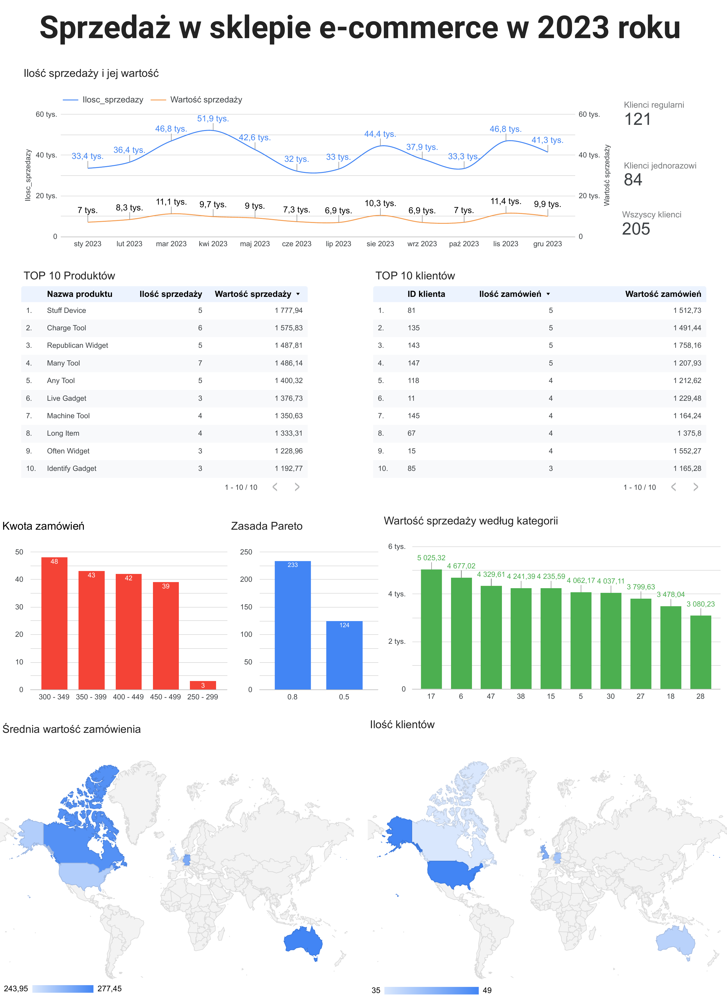

# Analiza danych sprzedażowych e-commerce

Utworzone: **23.08.2025**

Cel projektu:

Celem było zrozumienie zachowań klientów, sezonowości sprzedaży oraz identyfikacja najlepiej sprzedających się produktów i kategorii w sklepie e-commerce. Analiza miała wspomóc decyzje marketingowe i sprzedażowe oraz wskazać obszary do optymalizacji.

Krok po kroku:

* Pozyskanie danych za pomocą **zapytań SQL z Power query**
* Skopiowanie wyników do **Google Sheets**
* Przesłanie danych do **Looker Studio**
* Stworzenia dashboardu

Kluczowe wyniki:

1. **Sezonowość** 

    - Trzy główne fale sprzedaży: luty–kwiecień, lipiec–sierpień, październik–grudzień
    - Najlepszy miesiąc: listopad (11,4 tys. zł), najsłabsze: lipiec i wrzesień (po 6,9 tys. zł)
    - Rekomendacja: intensyfikacja działań marketingowych przed szczytami oraz promocje w okresach spadku sprzedaży

2. **Klienci**

    - 205 klientów w bazie: 59% stali, 41% jednorazowi
    - Rekomendacja: inwestycja w retencję i programy lojalnościowe zamiast wyłącznie pozyskiwania nowych klientów

3. **Produkty i kategorie**

    - Największa sprzedaż łączna: Stuff Device – 1 778 zł
    - Najczęściej kupowany: Many Tool – 7 szt. za 1 486 zł
    - Najbardziej dochodowe zamówienia: 450–499 zł
    - Kategoria lider: kategoria 17 – 5 025 zł
    - Rekomendacja: rozwój bestsellerów, cross-selling i bundling w najbardziej dochodowych segmentach

4. **Rynki**

    - Najwyższa średnia wartość koszyka: Australia (277 zł)
    - Najwięcej klientów: USA (49 osób)
    - Najniższa średnia wartość koszyka: UK (244 zł)
    - Rekomendacja: rozwój w Australii i USA, optymalizacja oferty w UK

5. **Analiza przychodów (Pareto)**

    - 31% zamówień → 50% przychodu
    - 58% zamówień → 80% przychodu
    - Wniosek: przychody rozłożone równomiernie, mniejsze ryzyko zależności od wąskiej grupy klientów

Wnioski i rekomendacje:

* Planowanie działań marketingowych zgodnie z sezonowością
* Maksymalizacja zysków w segmencie 450–499 zł przez upsell i bundling
* Rozwój retencji klientów i programów lojalnościowych
* Ekspansja bestsellerów i tworzenie zestawów „best sellers”
* Priorytetowe rynki: Australia i USA, optymalizacja działań w UK

Narzędzia:

* **Looker Studio** - wizualizacja danych i raportowanie
* **Google Big Query** - przechowywanie danych
* **Google Sheets** - wyniki z zapytań

Umiejętności:

* Zapytania SQL
* Tworzenie dashboardu
* Analiza i storytelling o danych
* Obsługa narzędzi Google
* Segmentacja klientów i analiza częstotliwości zamówień
* Analiza koszyka zakupowego, wartości zamówień i najlepiej sprzedających się produktów
* Analiza geograficzna pod kątem wartości koszyka i liczby klientów

**Efekt** Wskazanie najbardziej dochodowych produktów, segmentów klientów i rynków, a także opracowanie konkretnych rekomendacji marketingowych i sprzedażowych wspierających wzrost przychodów i retencję klientów.

