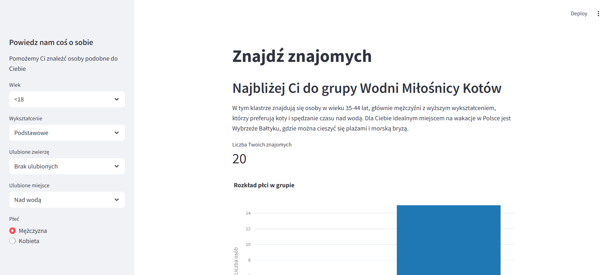

# Przewidywacz cen

Utworzone: **18.04.2025**

Stworzyłem aplikację, która analizuje odpowiedzi użytkownika na ankietę i przypisuje go do odpowiedniego klastra, wykorzystując wcześniej wytrenowany model uczenia maszynowego. Projekt został zrealizowany jako część kursu „Od zera do AI”.

Główne funkcje:

Zbieranie danych: Dane wejściowe pochodzą z ankiety zawierającej pytania dotyczące umiejętności technicznych, zainteresowań i doświadczenia.

Przetwarzanie danych: Dane zostały oczyszczone i przekształcone (m.in. standaryzacja, encoding).

Klasteryzacja: Wykorzystałem algorytmy do podziału użytkowników na grupy o podobnych cechach.

Dopasowywanie nowych użytkowników: Po wprowadzeniu danych, system przypisuje użytkownika do najbardziej pasującego klastra.

Wizualizacja i opis klastra: Po klasyfikacji, aplikacja wyświetla nazwę klastra oraz jego charakterystykę.

Technologie:
Python, scikit-learn, pandas, Git.

Wyróżniki projektu:

Praktyczne zastosowanie algorytmów nienadzorowanych w kontekście edukacyjnym.

Intuicyjna aplikacja pozwalająca użytkownikowi na szybkie poznanie swojego profilu w kontekście nauki AI.

Możliwość skalowania i rozbudowy (np. dodanie rekomendacji kursów na podstawie klastra).

<a href="https://github.com/Himap-3478/Find_friends" target="_blank" style="
  display: inline-flex;
  align-items: center;
  padding: 10px 20px;
  font-size: 16px;
  color: white;
  background-color: #24292e;
  border-radius: 5px;
  text-decoration: none;
  font-weight: bold;
">
  <svg height="20" width="20" viewBox="0 0 16 16" fill="white" style="margin-right: 8px;" xmlns="http://www.w3.org/2000/svg">
    <path d="M8 0C3.58 0 0 3.58 0 8c0 3.54 2.29 6.54 5.47 7.59.4.07.55-.17.55-.38 0-.19-.01-.82-.01-1.49-2.01.37-2.53-.49-2.69-.94-.09-.23-.48-.94-.82-1.13-.28-.15-.68-.52-.01-.53.63-.01 1.08.58 1.23.82.72 1.21 1.87.87 2.33.66.07-.52.28-.87.51-1.07-1.78-.2-3.64-.89-3.64-3.95 0-.87.31-1.59.82-2.15-.08-.2-.36-1.02.08-2.12 0 0 .67-.21 2.2.82.64-.18 1.32-.27 2-.27s1.36.09 2 .27c1.53-1.04 2.2-.82 2.2-.82.44 1.1.16 1.92.08 2.12.51.56.82 1.28.82 2.15 0 3.07-1.87 3.75-3.65 3.95.29.25.54.73.54 1.48 0 1.07-.01 1.93-.01 2.19 0 .21.15.46.55.38A8.013 8.013 0 0 0 16 8c0-4.42-3.58-8-8-8z"/>
  </svg>
  Odwiedź repozytorium GitHub
</a>

Tutaj screen z projektu:

