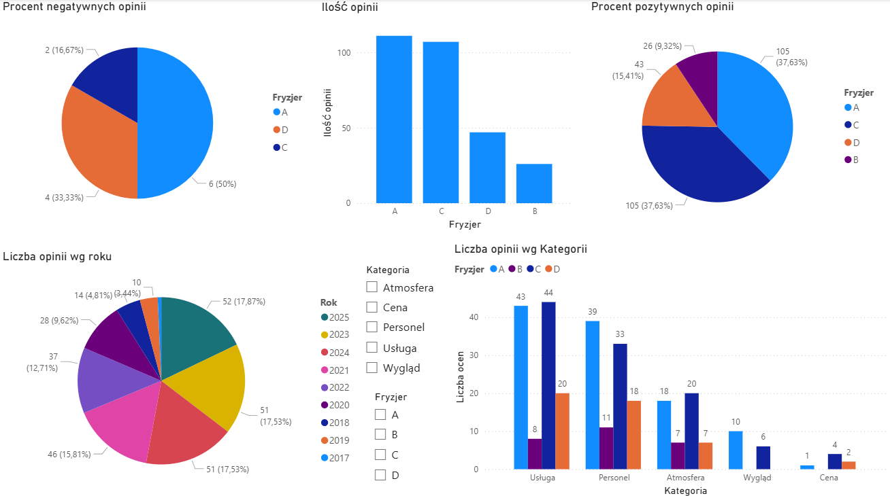

# Analiza salonów fryzjerskich

Utworzone: **11.09.2025**

Cel projektu:

Na podstawie danych pozyskanych z opinii Google, wybranych salonów fryzjerskich w Kartuzach znaleźć najlepszego fryzjera.

Krok po kroku:

* Wybranie analizowanych salonów: **A, B, C, D**
* Skopiowanie opinii do MS Word
* Podzielenie opinii na kategorie i podział na oceny negatywna/pozytywna: 
    - Usługa – jakość fryzur i zadowolenie klienta
    - Personel – podejście do klienta
    - Wygląd – estetyka salonu
    - Atmosfera – ogólne wrażenia
    - Cena – relacja jakość/cena
* Import do MS Excel
* Projekt i budowa dashboardu w Power BI

Kluczowe wnioski:
1. **Najwięcej pozytywnych opinii**: Fryzjer C i A (po 105)
2. **Najwięcej negatywnych**: Fryzjer A (6), Fryzjer B – 0
3. **Najwięcej opinii w kategorii**: Usługa (115); **najmniej** Cena (7)
4. **Najwięcej opinii w roku**: 2025 (52); **najmniej** w 2017 roku (2)
5. **Łącznie najwięcej opinii**: Fryzjer A (111); **najmniej** Fryzjer B (26)

Narzędzia:

* **Mapy Google** - opinie
* **MS Word** - wklejanie surowych opinii
* **MS Excel** – skategoryzowane opinie
* **Power BI** - dashboard

Umiejętności wykorzystane w projekcie:

* Samodzielne pozyskiwanie danych
* Analiza i interpretacja informacji liczbowych
* Tworzenie dashboardów w Power BI
* Czyszczenie i organizacja materiału analitycznego
* Prezentacja wyników w formie czytelnego raportu
* Wyciąganie wniosków biznesowych z analiz

**Efekt:**  
1. Dane pozwoliły mi zobaczyć pełniejszy obraz, a nie opierać się na subiektywnych rekomendacjach.
2. Popularność nie zawsze oznacza brak negatywnych opinii – dlatego ważna jest analiza jakościowa
3. Na podstawie wyników świadomie wybrałem Fryzjera C – najlepszy balans popularności i jakości usług.

