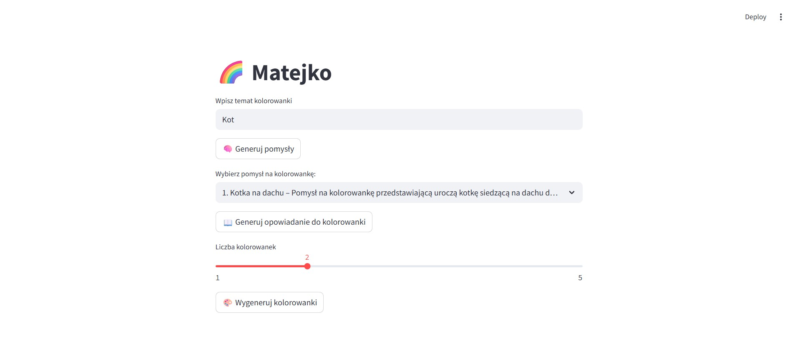
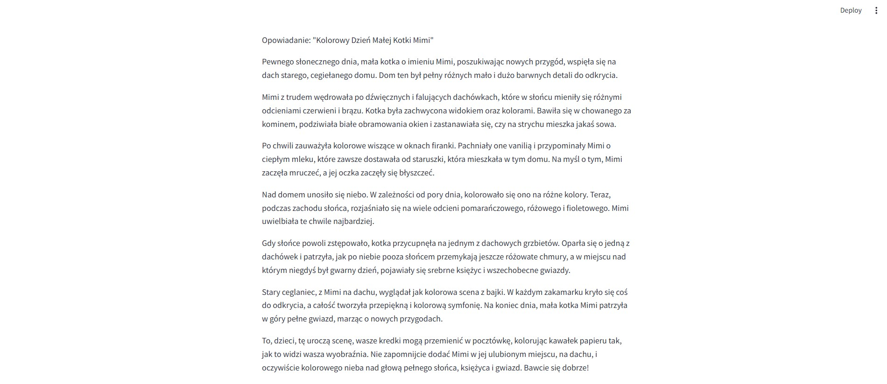

# Generator kolorowanek

Utworzono: **29.04.2025**

Zadaniem aplikacji jest **generowanie kolorowanek i opowiadań**. Użytkownik wpisuje temat kolorowanki. Następnie AI podaje kilka tematów, z których użytkownik wybiera jeden oraz wybiera ilość kolorowanek. Po kliknięciu przycisku **"Generuj kolorowanki"** AI tworzy kolorowanki na podany temat i w odpowiedniej ilości. Jest także możliwośc pobrania i wydrukowania kolorowanki, dzięki przyciskowi **Pobierz kolorowankę**. Użytkownik może także za pomocą przycisku **"Generuj opowiadanie"** polecić sztucznej inteligencji wygenerowanie krótkiego opowiadania do wybranego tematu. Celem aplikacji jest zapewnienie dzieciom zajęcia na deszczowe lub zimowe dni. 

Tutaj trzy screeny z projektu:

