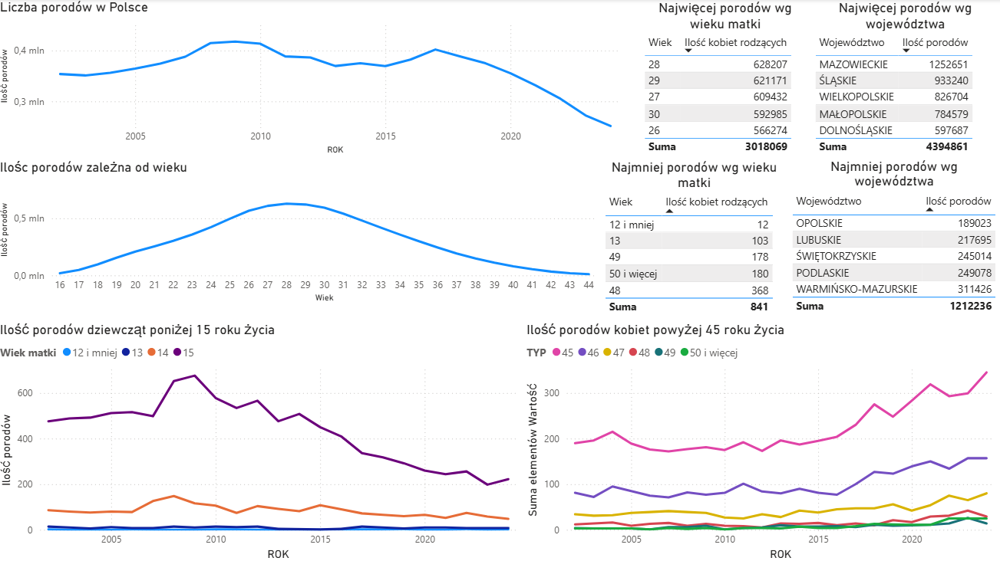
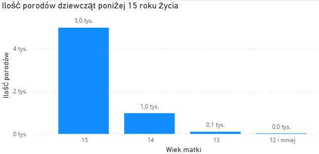
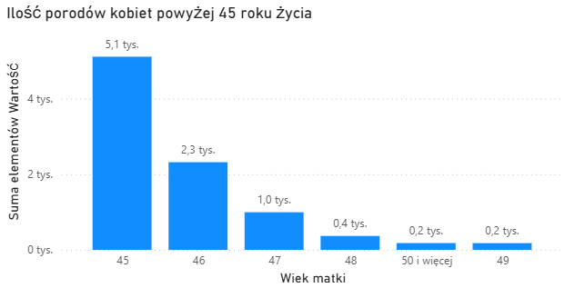

# Ilość urodzeń żywych w Polsce wg wieku matki

Utworzone: **06.10.2025**

Cel projektu:

Analiza danych Głównego Urzędu Statystycznego (GUS) dotyczących ilości urodzeń według wieku matki w latach 2002-2024

Krok po kroku:

* Pobranie danych z GUS
* Oczyszczenie i przygotowanie tych danych w Excelu
* Przesłanie danych do Power BI
* Poprawienie danych w Power Query
* Stworzenie dashboardu

Kluczowe wnioski:
1. **Najwięcej porodów**: 2009 – 417 589
2. **Najmniej porodów**: 2004 – 251 782
3. **Tendencja**: Od 2017 roku liczba porodów bardzo szybko spada
4. **Rozkład porodów**: Liczba kobiet rodzących rośnie do 28 roku życia, a potem stopniowo maleje.
5. **Ciąże dzieci**:
    - ≤12 lat: 12 przypadków
    - 13 lat: 103 przypadki
    - Łącznie żywych urodzeń z ciąż dziecięcych: 6 065
    - Plusem jest to, że liczba porodów dziewcząt poniżej 15 roku życia spada od 2009 roku
6. **Porody lobiet 45+**: rośnie od 2016 roku
7. **Najwięcej porodów wg wieku**: kobiety w wieku 25–31 lat
8. **Najwięcej porodów wg wojewódzctwa**: woj. mazowieckie – 1 252 651; **najmniej porodów**: woj. opolskie – 189 023

Narzędzia:

* **MS Excel** – czyszczenie danych
* **Power Query** - poprawianie danych
* **Power BI** - dashboard

Umiejętności wykorzystane w projekcie:

* Praca z ogólnodostepnymi danymi
* Analiza i interpretacja informacji liczbowych
* Tworzenie dashboardów w Power BI
* Czyszczenie i organizacja materiału analitycznego
* Prezentacja wyników w formie czytelnego raportu
* Wyciąganie wniosków biznesowych z analiz

**Podsumowując:**  
1. **Wiek rodzących**: Trend przesunięcia wieku rodzących ku starszym grupom pokazuje rosnące znaczenie edukacji zawodowej i planowania rodziny.
2. **Ciąże dziecięce**: Spadek ciąż wśród dziewcząt poniżej 15 lat wskazuje na skuteczność działań profilaktycznych, choć problem wciąż istnieje.
3. **Wyzwania**:Wzrost ciąż kobiet powyżej 45 roku życia stawia wyzwania dla systemu opieki zdrowotnej i polityki prorodzinnej.
4. **Programy socjalne**: Nieskuteczność programu 500+/800+

