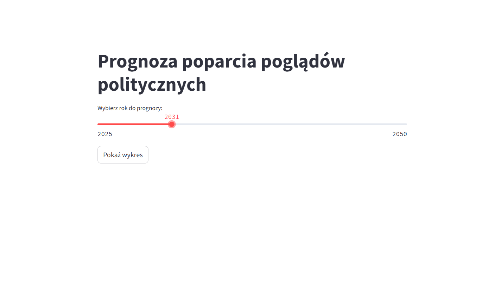
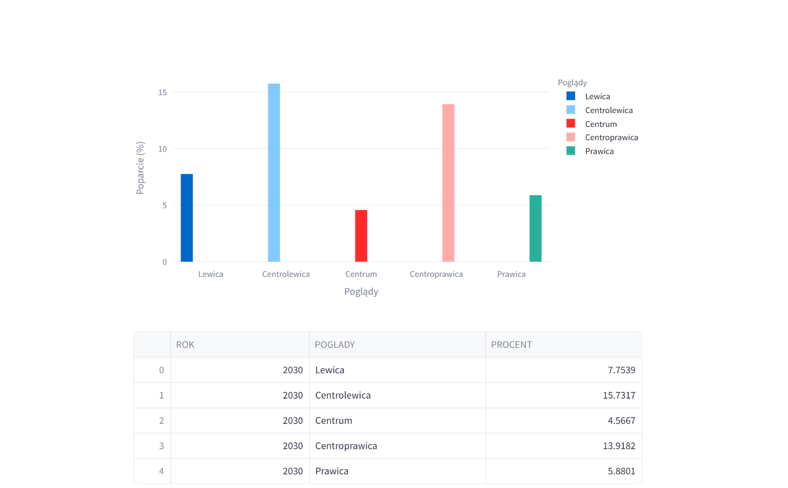

# Aplikacja predykcyjna trendów politycznych w Polsce (1990–obecnie)

Utworzone: **03.06.2025**

### 📌 **Opis projektu:**

Stworzyłem aplikację predykcyjną opartą na danych historycznych z polskich wyborów **parlamentarnych**, **prezydenckich** oraz **do Parlamentu Europejskiego** od 1990 roku. Głównym celem było **modelowanie i prognozowanie zmian poparcia społecznego dla różnych poglądów politycznych (lewica, centrolewica, centrum, centroprawica, prawica)** w ujęciu czasowym.

Zastosowane techniki:

* **Uczenie maszynowe (machine learning):**
  * Regresja liniowa, modele ensemble (np. Random Forest, XGBoost)
  * Walidacja krzyżowa, tuning hiperparametrów

* **Analiza szeregów czasowych:**
  * Trendy, sezonowość i dekompozycja czasowa
  * Predykcja zmian poparcia w kolejnych latach

* **Eksploracja danych (EDA):**
  * Identyfikacja kluczowych korelacji i zależności (np. wpływ typu wyborów, udziału partii, preferencji regionalnych)

Funkcje aplikacji:

* Interaktywne wybieranie roku i typu wyborów
* Dynamiczne prognozy poparcia dla poszczególnych ideologii politycznych
* Wizualizacja trendów i zmian preferencji w czasie
* Możliwość porównywania scenariuszy (np. lata 90. vs współczesność)

Technologie:

* **Python** (pandas, scikit-learn, matplotlib, seaborn, plotly)
* **Streamlit** (do stworzenia aplikacji webowej)
* **Jupyter Notebook** (eksperymenty i prototypowanie modeli)
* **Excel** (do raportów porównawczych i walidacji danych historycznych)

Wartość analityczna

Projekt pokazuje, jak za pomocą danych historycznych i predykcji można symulować zmiany społecznych nastrojów politycznych i interpretować je w kontekście rzeczywistych wydarzeń. Jest to przykład połączenia **analizy danych publicznych, modelowania predykcyjnego i komunikacji wyników w formie aplikacji**.

**Umiejętności:**
* ETL i EDA
* streamlit
* numpy
* joblib
* sklearn
* plotly
* pandas
* Python
* Uczenie maszynowe
* Predykcja modelu

<a href="https://github.com/Himap-3478/Przewidywacz-pogl-d-w" target="_blank" style="
  display: inline-flex;
  align-items: center;
  padding: 10px 20px;
  font-size: 16px;
  color: white;
  background-color: #24292e;
  border-radius: 5px;
  text-decoration: none;
  font-weight: bold;
">
  <svg height="20" width="20" viewBox="0 0 16 16" fill="white" style="margin-right: 8px;" xmlns="http://www.w3.org/2000/svg">
    <path d="M8 0C3.58 0 0 3.58 0 8c0 3.54 2.29 6.54 5.47 7.59.4.07.55-.17.55-.38 0-.19-.01-.82-.01-1.49-2.01.37-2.53-.49-2.69-.94-.09-.23-.48-.94-.82-1.13-.28-.15-.68-.52-.01-.53.63-.01 1.08.58 1.23.82.72 1.21 1.87.87 2.33.66.07-.52.28-.87.51-1.07-1.78-.2-3.64-.89-3.64-3.95 0-.87.31-1.59.82-2.15-.08-.2-.36-1.02.08-2.12 0 0 .67-.21 2.2.82.64-.18 1.32-.27 2-.27s1.36.09 2 .27c1.53-1.04 2.2-.82 2.2-.82.44 1.1.16 1.92.08 2.12.51.56.82 1.28.82 2.15 0 3.07-1.87 3.75-3.65 3.95.29.25.54.73.54 1.48 0 1.07-.01 1.93-.01 2.19 0 .21.15.46.55.38A8.013 8.013 0 0 0 16 8c0-4.42-3.58-8-8-8z"/>
  </svg>
  Odwiedź repozytorium GitHub
</a>

Tutaj screen z projektu:

