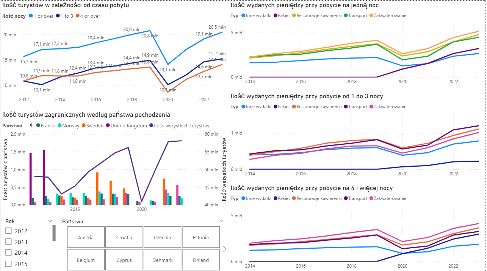
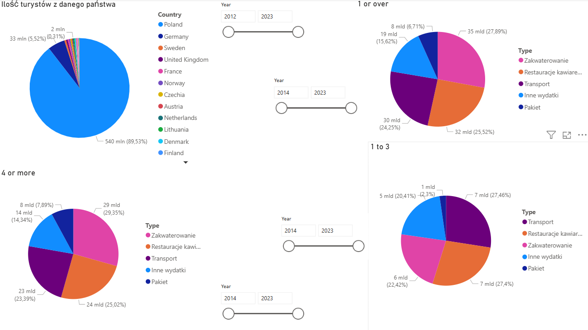

# Analiza danych z Eurostatu nt. turystyki w Polsce

Utworzone: **06.09.2025**

Cel projektu:

Na podstawie danych z Eurostatu z lat 2014–2023 zobaczyć, skąd do Polski przyjeżdżają turyści, jak długo zostają i na co wydają pieniądze.

Krok po kroku:

* Pobranie danych z Eurostatu
* Oczyszczenie i przygotowanie tych danych w Excelu
* Przesłanie danych do Power BI
* Poprawienie danych w Power Query
* Stworzenie dashboardu

Kluczowe wnioski:
1. **Rekordowy rok**: 58 mln turystów w 2023 r.
2. **Najczęściej Polskę odwiedzają**: Polacy i Niemcy stanowią 95% turystów; spośród innych krajów najwięcej w ostatnich latach przyjeżdża ze Szwecji, Czech i Francji.
3. **Noclegi**: 20,5 mln turystów wybiera pobyt na 1 noc; brak danych o 8,2 mln noclegów sugeruje popularność Airbnb lub pobytów u rodziny/znajomych.
4. **Wydatki**:
    - 1 noc: zakwaterowanie 35 mld €, gastronomia 32 mld €, transport 30 mld €.
    - 1–3 noce: transport i gastronomia po 7 mld €, zakwaterowanie 6 mld €.
    - 4+ noce: zakwaterowanie 29 mld €, gastronomia 24 mld €, transport 23 mld €.
5. **Pakiety turystyczne**: od 2019 rośnie ich popularność (nocleg + jedzenie + transport).

Narzędzia:

* **MS Excel** – czyszczenie danych
* **Power Query** - poprawianie danych
* **Power BI** - dashboard

Umiejętności wykorzystane w projekcie:

* Praca z ogólnodostepnymi danymi
* Analiza i interpretacja informacji liczbowych
* Tworzenie dashboardów w Power BI
* Czyszczenie i organizacja materiału analitycznego
* Prezentacja wyników w formie czytelnego raportu
* Wyciąganie wniosków biznesowych z analiz

**Insight dla branż:**  
1. **Hotele**: rozwijać oferty weekendowe i city breaki.
2. **Gastronomia**: menu w kilku językach, płatności bezgotówkowe.
3. **Transpor**t: potencjał w lokalnym transporcie i wynajmie samochodów
4. **Turystyka**: rosnący popyt na atrakcje, przewodników i bilety online.

